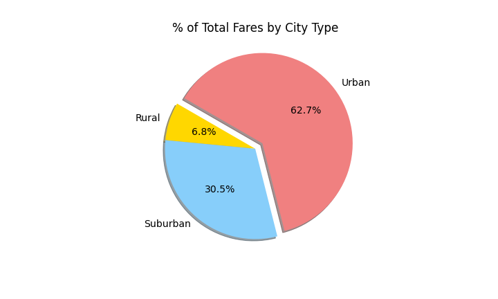

# PyBer_Analysis

## Overview of the analysis:
<!-- The purpose of the new analysis is well defined. (3 pt) -->
The ride share company PyBer requires a summary report for ride-sharing data based on city demographics. This report gathers that information based on city type (Rural, Suburban, Urban) and visualizes the data in multiple-line graphs and pie charts. The data will then be used to make decisions on areas for further expansion. 

### Resources Used
* Data Source: city_data.csv
* Date Source: ride_data.csv
* Software: Jupyter Notebook 6.4.8

## Results:
<!-- There is a description of the differences in ride-sharing data among the different city types. Ride-sharing data include the total rides, total drivers, total fares, average fare per ride and driver, and total fare by city type. (7 pt) -->

### PyBer Weekly Revenue Summary

The analysis shows a clear distinction between each of the 3 city types. Even with slight increases and decreases each week, the Urban environment consistently had the highest profit of all city types. The Rural environment consistently had the lowest total profit each week. And the Suburban environment fell in between the other two every week. In fact, the minimum weekly fare for Urban cities in the beginning of January ($1661.68) is still higher than the maximum weekly fare for the Suburban environment in late February ($1412.74). The same pattern holds when comparing the minimum Suburban weekly total ($721.60) to the maximum Rural weekly total ($501.24). This seems to suggest that the Urban setting holds the highest potential for future profits. 

### PyBer Resource Distributions

The above trend prioritizing Urban settings, followed by Suburban, then Rural is also suggested in each of the 3 pie charts below. 

The percentage of rides fulfilled follows closely with the total amount of fares for each city type. Nearly two-thirds of the ride share data comes from an Urban setting, while the suburban setting makes up a significant chunk of the remaining data. It is particularly interesting to note that 80% of PyBer drivers work in an Urban environment. This may actually suggest that there are already a sufficient amount of employees working in the Urban setting. The setting which appears to have the biggest discrepancy is the Suburban setting, which currently only has 16% of the employees, but generates 30% of the company revenue.

### PyBer Average Weekly Revenue

Finally the analysis looked at the average fare collected per ride each week. The chart above shows this data. There is an overall trend that suggests Rural environments will have the most expensive rides, followed by Suburban, then Urban settings will have the least expensive rides on average. This data also shows that the Urban environment has the most consistent fare amount, as the range of average fares only spans $3.40 (from $22.59-$25.99). The average fare for Suburban environments are relatively consistent, ranging $8.80 (from $26.60-$35.39). However by comparison, the average fare in a Rural setting is extremely volatile, having massive peaks and valleys on a seemingly weekly basis. The range of fares in the Rural setting is $15.99 (from $22.55-$38.54). 

## Summary
<!-- There is a statement summarizing three business recommendations to the CEO for addressing any disparities among the city types. (4 pt) -->
### Urban Suggestions
In the Urban setting there is a need to increase the efficacy of the pre-existing employee base that is currently offering rides. Ideally this will bring the percentage of Urban fares up to match the percentage of Urban drivers already working for the company. Next steps to achieve this goal may include:

* Analyzing location data to identify urban areas in which to station more drivers
* Increasing the upfront cost for a customer to reserve a driver to supplement the short distances for each ride

### Suburban Suggestions
In the Suburban setting there is a need to build up the employee base to meet an increased demand for rides. Ideally this would bring the percentage of drivers up to match the percentage of rides requested in the Suburban environment. Next steps to achieve this goal may include:

* Increased outreach to single-income suburban households for part-time opporunities with PyBer
* Increased outreach to college students and young adults in suburban areas for part-time opporunities with PyBer

### Rural Suggestions
The Rural setting has a similar need for additional employees as the Suburban setting. In contrast, the Rural setting is the most volatile market of the three city types, and efforts to expand in this area should be advanced with caution due to the seeming lack of current interest in PyBer services. Suggestions to increase consistency amongst PyBer's Rural business may include:

* Increase advertising of PyBer services for daily services frequented by Rural populations (i.e. 'PyBer can help pick up groceries', 'PyBer can get you home safely from the bar', etc.)
* Increase advertising of PyBer services for special occassions frequented by Rural populations (i.e. 'Get a PyBer to head out to the ball game in the city', 'PyBer can help get you to the airport to catch your flight', etc.)
